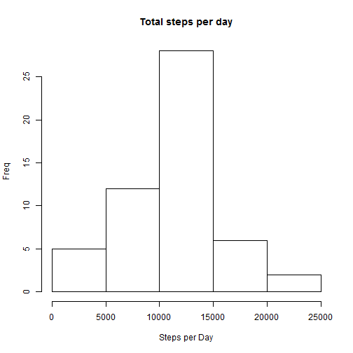
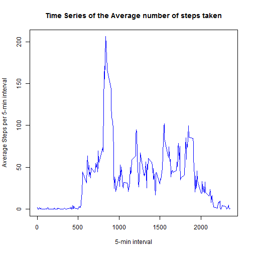
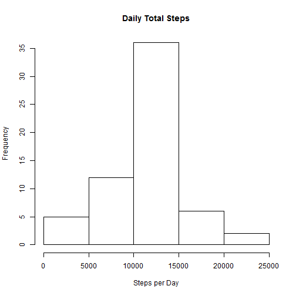

Reproducible Research: Peer Assessment 1
========================================

## Loading and preprocessing the data

### Loading the dataset in R


```r
data <- read.csv("activity.csv", 
                 colClasses = c("numeric", "character","numeric"))
```

### Checking the dataset variables


```r
names(data)
```

```
## [1] "steps"    "date"     "interval"
```

### Checking the dataset head and tail


```r
head(data)
```

```
##   steps       date interval
## 1    NA 2012-10-01        0
## 2    NA 2012-10-01        5
## 3    NA 2012-10-01       10
## 4    NA 2012-10-01       15
## 5    NA 2012-10-01       20
## 6    NA 2012-10-01       25
```

```r
tail(data)
```

```
##       steps       date interval
## 17563    NA 2012-11-30     2330
## 17564    NA 2012-11-30     2335
## 17565    NA 2012-11-30     2340
## 17566    NA 2012-11-30     2345
## 17567    NA 2012-11-30     2350
## 17568    NA 2012-11-30     2355
```

### Formatting the date field 


```r
data$date <- as.Date(data$date,"%Y-%m-%d")
```

## What is mean total number of steps taken per day?

### Getting a summary of the dataset. 


```r
summary(data)
```

```
##      steps            date               interval   
##  Min.   :  0.0   Min.   :2012-10-01   Min.   :   0  
##  1st Qu.:  0.0   1st Qu.:2012-10-16   1st Qu.: 589  
##  Median :  0.0   Median :2012-10-31   Median :1178  
##  Mean   : 37.4   Mean   :2012-10-31   Mean   :1178  
##  3rd Qu.: 12.0   3rd Qu.:2012-11-15   3rd Qu.:1766  
##  Max.   :806.0   Max.   :2012-11-30   Max.   :2355  
##  NA's   :2304
```

### The summary above excludes the NA???s but the calculated mean of 37.38 steps is the mean at the discrete interval of 5 min and NOT the mean of the total number of steps take per day.

### Using the aggregate function to create a summary dataset by date and then calculating the means of the total number of steps per day


```r
data_dailysummary <- aggregate(steps ~ date, data = data, sum, na.rm = TRUE)

mean(data_dailysummary$steps)
```

```
## [1] 10766
```

### Plotting a histogram to visualize the distribution of the total number of steps per day


```r
library(lattice)

hist(data_dailysummary$steps, 
main = "Total steps per day", 
xlab = "Steps per Day", 
ylab="Freq", 
col = "white")
```

 

## What is the average daily activity pattern?

### Making a time series plot (i.e. type = ???l???) of the 5-minute interval (x-axis) and the average number of steps taken, averaged across all days (y-axis)

### Getting the mean of steps and time series data


```r
time_series_data <- tapply(data$steps, data$interval, mean, na.rm = TRUE)
```

### Plotting the mean of steps using the time series data


```r
plot(row.names(time_series_data), time_series_data, 
type = "l", 
xlab = "5-min interval", 
ylab = "Average Steps per 5-min interval", 
main = "Time Series of the Average number of steps taken", 
col = "blue")
```

 

### Which 5-minute interval, on average across all the days in the dataset, contains the maximum number of steps?


```r
max_steps_interval <- which.max(time_series_data)
```

### then identifying the 5-minute interval of max_steps_interval


```r
names(max_steps_interval)
```

```
## [1] "835"
```

## Imputing missing values

### Calculate and report the total number of missing values in the dataset


```r
summary(data$steps)
```

```
##    Min. 1st Qu.  Median    Mean 3rd Qu.    Max.    NA's 
##     0.0     0.0     0.0    37.4    12.0   806.0    2304
```

### Devise a strategy for filling in all of the missing values in the dataset. The strategy does not need to be sophisticated. For example, you could use the mean/median for that day, or the mean for that 5-minute interval,etc

### Using the approach to calculate the mean of the number of steps by 5-min interval


```r
StepsAverageByInterval <- aggregate(steps ~ interval, data = data, FUN = mean)
```

### Then creating a function to fill the average of steps at the intervals with value NA of the dataset with all observations


```r
NAFilling <- numeric()
for (i in 1:nrow(data)) {
          xi <- data[i, ]
          if (is.na(xi$steps)) {
                    steps <- subset(StepsAverageByInterval, interval == xi$interval)$steps
          } else {
                    steps <- xi$steps
          }
          NAFilling <- c(NAFilling, steps)
}
```

### And creating a new dataset that is equal to the original dataset but with the missing data filled in using the mean of the number of steps at the respective 5-min interval. By applying the summary function validates that there are no NAs and the length


```r
data_NAfilled <- data
data_NAfilled$steps <- NAFilling
summary(data_NAfilled$steps)
```

```
##    Min. 1st Qu.  Median    Mean 3rd Qu.    Max. 
##     0.0     0.0     0.0    37.4    27.0   806.0
```


### Both datasets have the same dimensions


```r
dim(data)
```

```
## [1] 17568     3
```

```r
dim(data_NAfilled)
```

```
## [1] 17568     3
```

### Making a histogram of the total number of steps taken each day and Calculate and report the mean and median total number of steps taken per day. Do these values differ from the estimates from the first part of the assignment? What is the impact of imputing missing data on the estimates of the total daily number of steps?


```r
TotalSteps <- aggregate(steps ~ date, data = data_NAfilled, sum, na.rm = TRUE)

hist(TotalSteps$steps, main = "Daily Total Steps", xlab = "Steps per Day", col = "white")
```

 

### Calculating the mean and median of the steps we conclude:

### (1) The mean is the same due to the fact that we filled the NAs with the mean (no impact on the mean calculation)


```r
mean(TotalSteps$steps)
```

```
## [1] 10766
```

### (2) However the median is different in comparison to the original one and now it is equal to the mean.


```r
median(TotalSteps$steps)
```

```
## [1] 10766
```

## Are there differences in activity patterns between weekdays and weekends?

### For this part the weekdays() function may be of some help here. Use the dataset with the filled-in missing values for this part.

### Creating a new factor variable in the dataset with two levels: weekday and weekend indicating whether a given date is a weekday or weekend day.


```r
DayType <- weekdays(data$date)
WeekDay <- vector()
for (i in 1:nrow(data)) {
          if (DayType[i] == "Saturday") {
                    WeekDay[i] <- "Weekend"
          } else if (DayType[i] == "Sunday") {
                    WeekDay[i] <- "Weekend"
          } else {
                    WeekDay[i] <- "Weekday"
          }
}

data$WeekDay <- WeekDay
data$WeekDay <- factor(data$WeekDay)
DailySteps <- aggregate(steps ~ interval + WeekDay, data = data, mean)

names(DailySteps) <- c("interval", "WeekDay", "steps")
```

### Make a panel plot containing a time series plot (i.e. type = ???l???) of the 5-minute interval (x-axis) and the average number of steps taken, averaged across all weekday days or weekend days (y-axis). 


```r
xyplot(steps ~ interval | WeekDay, DailySteps, type = "l", layout = c(1, 2), 
       panel = lattice.getOption("panel.xyplot"),
       xlab = "Interval", 
       ylab = "Number of steps",
)
```

 

#### Note: It looks like this individual practices some activity during the morning due to spike during the weekdays (Monday Thru Friday) and have weekends with activity spread during the day.  
